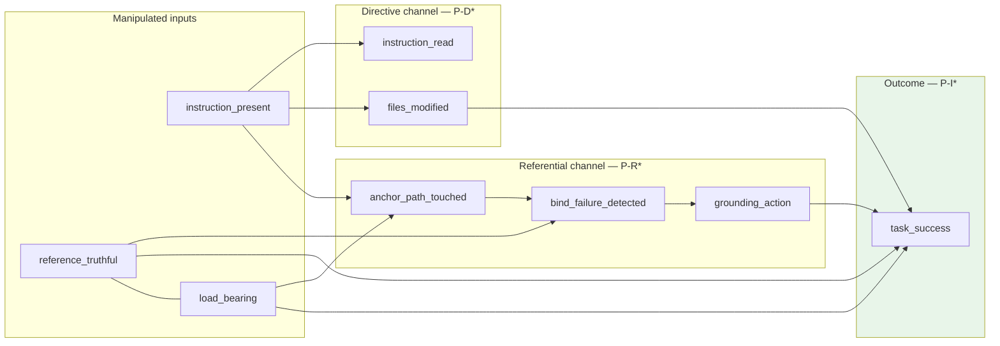

# Late-Binding Model v2 — Predictive Framework

**Status:** Pre-registered predictions (supersedes v1 for inference)  
**Version:** `LATE_BINDING_MODEL_v2`  
**Date:** 2026-07-03  
**Descriptive archive:** `docs/LATE_BINDING_MODEL_v1.md` (historical synthesis only — not used for forward predictions)  
**Primary test battery:** RQ5 v2 factorial (`docs/RQ5_FACTORIAL_PROTOCOL.md`)  
**Static panel:** RQ1–RQ4 on held-out cohorts

---

## 0. What changed from v1

v1 **described** patterns already observed (read rates, born-stale prevalence, null A−B success). v2 **commits to quantitative predictions** that can fail before data are inspected. Each hypothesis below was written **without conditioning on unreported outcomes**; v1 results appear only in §8 as *prior context*, not as justification for the prediction direction.

A hypothesis is **supported** only if the expected observation holds **and** the falsification criterion is not met. A hypothesis is **falsified** if the falsification criterion triggers, regardless of narrative fit.

---

## 1. Model statement (predictive)

**Claim:** Machine-consumed instruction files affect agent outcomes through two **independently measurable** channels whose effects combine multiplicatively at runtime:

| Channel | Mechanism | Primary measurable |
|---------|-----------|-------------------|
| **Directive (D)** | Normative text shapes goals, scope, and tool policy | `instruction_read`, `files_modified`, tool-call mix |
| **Referential (R)** | Pointers are **late-bound** at consumption against the workspace | `anchor_path_touched`, `bind_failure_detected`, success conditional on truth×load-bearing |

**Central prediction (P-I1):** Static referential truth affects `task_success` **only through** the interaction `truth × load_bearing`. The truth **main effect** on success is zero when load-bearing is controlled and tasks are difficulty-calibrated.

**Not predicted:** That most false references cause failure (peripheral references may be followed without outcome change).  
**Not predicted:** That instruction presence improves success (directive channel may expand scope without passing tests).

---

## 2. Operational definitions (measurement contracts)

| Construct | Operational definition | Pass/fail instrument |
|-----------|------------------------|----------------------|
| `instruction_present` | Instruction file path exists in workspace before agent start | File listing + manifest SHA256 |
| `instruction_read` | Trace shows open/read/quote of `instruction_path` | Automated trace classifier + 10% human audit |
| `reference_truthful` | Cited anchor resolves in `git ls-tree` at pinned SHA | Mechanical verifier (100% gate) |
| `load_bearing` | Task rubric requires edit/execute/inspect of cited anchor (LB) vs decoy only (PB) | Design checklist + blind κ audit |
| `bind_failure_detected` | Tool error or explicit retry after targeting false anchor | Trace rubric M2 (RQ5 v2 §9) |
| `grounding_action` | Search/glob/read-sibling/instruction-self-edit within 10 steps after M2 | Trace rubric M3 |
| `task_success` | Required edit applied ∧ test command exit 0 ∧ no scope violation | Objective evaluator |
| `environmental_difficulty` | Composite calibration score ∈ [0.40, 0.60] expected success | `exports/task_calibration/` |

---

## 3. Hypothesis registry

Each entry uses the same template:

- **Prediction** — quantitative where possible, registered before main analysis  
- **Expected observation** — what supports the hypothesis  
- **Alternative observation** — what supports a competing account  
- **Falsification** — precise condition that rejects the hypothesis (not “partial support”)

---

### Static layer (longitudinal panel)

#### P-S1 — Born-false dominates post-verification decay

| | |
|--|--|
| **Prediction** | In a new E1-scale cohort, the rate of references **never VERIFIED** at first observation (born-false) exceeds the rate of **genuine post-verification first_missing** events by at least **5×**. |
| **Expected observation** | Born-false / genuine-decay ratio ≥ 5 on held-out panel with identical extraction rules. |
| **Alternative observation** | Ratio < 2, or genuine decay ≥ 20% of all MISSING transitions after first VERIFIED. |
| **Falsification** | Ratio < 2 **or** ≥ 15% of repos show ≥ 1 genuine post-verification decay per 100 verifiable references. **Interpretation:** “decay” framing fits static panel; late-binding static layer mis-specified. |

**Test:** RQ2 failure audit on held-out `reference_longitudinal.csv` split; pre-specified before cohort merge.

---

#### P-S2 — Instruction files preferentially cite stable paths

| | |
|--|--|
| **Prediction** | Matched cited paths have **≤** uncited control churn in ≥ **80%** of within-repo pairs (same metric as selection study). |
| **Expected observation** | Median paired churn difference ≤ 0; ≥ 80% pairs with Δ ≥ 0 favor cited side. |
| **Alternative observation** | Cited paths churn **more** than controls in > 50% of pairs (median Δ > 0). |
| **Falsification** | Two-sided Wilcoxon on paired Δ rejects null with **cited > uncited** at α = 0.05 on held-out sample. **Interpretation:** selection mechanism absent; peripheral false refs cannot explain null causal effects. |

**Test:** `run_selection_study.py` on held-out repos not in pilot.

---

#### P-S3 — Agent-attributed instruction edits are measurable and non-rare

| | |
|--|--|
| **Prediction** | Among repos with agent-attributed commits touching instruction paths, **≥ 10%** of instruction files receive ≥ 1 agent edit within 90 days of first instruction-file appearance. |
| **Expected observation** | Attribution precision ≥ 0.90 (P4 gate) and edit rate ≥ 10%. |
| **Alternative observation** | Edit rate < 3% despite high instruction-file adoption. |
| **Falsification** | Edit rate < 3% with adoption ≥ 30% of cohort. **Interpretation:** instruction files are static for agents; maintenance channel irrelevant. |

**Test:** P4 attribution on held-out commit window.

---

### Directive channel (Factor A: presence)

#### P-D1 — Instruction presence increases read rate

| | |
|--|--|
| **Prediction** | P(`instruction_read` \| present) − P(`instruction_read` \| absent) ≥ **0.90**. |
| **Expected observation** | Read rate ≥ 0.95 when present; ≤ 0.05 when absent (cell `N`). |
| **Alternative observation** | Read rate when present < 0.70, or absent > 0.30 (agents read non-injected paths as substitute). |
| **Falsification** | Δ < 0.50 with 95% CI entirely below 0.70. **Interpretation:** directive surface not consumed; H1 mechanism invalid. |

**Test:** RQ5 v2 cell `N` vs any present cell; primary agent Claude Code; n ≥ 120 cases × 3 replicates.

---

#### P-D2 — Instruction presence expands edit scope

| | |
|--|--|
| **Prediction** | E[`files_modified` \| present] − E[`files_modified` \| absent] ≥ **5** files (cluster-robust mean difference). |
| **Expected observation** | Present arm median ≥ 10 files; absent arm median ≤ 5 files (v1 pilot order-of-magnitude). |
| **Alternative observation** | |Δ| < 2 files with CI including 0. |
| **Falsification** | Δ ≤ 1 file at upper 95% CI bound < 3. **Interpretation:** instructions are inert for behaviour; decorative-doc alternative holds. |

**Test:** RQ5 v2 `N` vs pooled present cells; covariate: ecosystem block.

---

#### P-D3 — Directive channel does not require success improvement

| | |
|--|--|
| **Prediction** | P(`task_success` \| present) − P(`task_success` \| absent) has 95% CI **including zero**; point estimate \|Δ\| < **0.10**. |
| **Expected observation** | Success rates similar across A factor; scope expansion (P-D2) without pass-rate gain. |
| **Alternative observation** | Present improves success by ≥ 15 pp with CI excluding 0. |
| **Falsification** | **Not applicable for rejection of model** — this is a qualifying null prediction. If present **harms** success by Δ ≤ −0.15, revise directive channel as net-negative noise. |

**Test:** RQ5 v2 marginal across present vs `N`.

---

### Referential channel (Factor B: truth, conditional on presence)

#### P-R1 — Agents attempt late binding on cited anchors

| | |
|--|--|
| **Prediction** | P(`anchor_path_touched` \| present) ≥ **0.60** pooled across truth levels. |
| **Expected observation** | Tool traces target cited path in majority of present runs. |
| **Alternative observation** | Touch rate < 0.30 despite P-D1 read rate > 0.90. |
| **Falsification** | Touch rate < 0.30 with read rate > 0.85. **Interpretation:** referential channel read but not executed; late-binding mechanism dead. |

**Test:** RQ5 v2 present cells; trace classifier v2.

---

#### P-R2 — Truth affects success only in load-bearing stratum

| | |
|--|--|
| **Prediction** | \|P(success \| true, LB) − P(success \| false, LB)\| ≥ **2 ×** \|P(success \| true, PB) − P(success \| false, PB)\| and PB difference 95% CI includes **0**. |
| **Expected observation** | LB truth gap ≥ 10 pp; PB gap ≤ 5 pp with CI spanning 0. |
| **Alternative observation** | PB truth gap ≥ LB truth gap, or LB gap CI includes 0 while PB gap excludes 0. |
| **Falsification** | PB effect ≥ LB effect (same sign) with interaction β₃ ≤ 0 in prespecified logistic model (P-I1). **Interpretation:** truth operates independently of load-bearing; model misspecified. |

**Test:** RQ5 v2 cells `T+L`/`F+L` vs `T+P`/`F+P`.

---

#### P-R3 — False load-bearing anchors trigger bind failures

| | |
|--|--|
| **Prediction** | P(`bind_failure_detected` \| false, LB) ≥ **0.40**. |
| **Expected observation** | M2 coded in ≥ 40% of `F+L` runs. |
| **Alternative observation** | M2 rate < 0.15 despite P-R1 touch rate > 0.50 on `F+L`. |
| **Falsification** | M2 < 0.15 with anchor touch > 0.50 on `F+L`. **Interpretation:** agents silently skip false targets; repair path (P-R4) untestable. |

**Test:** RQ5 v2 cell `F+L` only.

---

#### P-R4 — Agents ground after bind failure

| | |
|--|--|
| **Prediction** | P(`grounding_action` \| `bind_failure_detected`, false, LB) ≥ **0.40**. |
| **Expected observation** | M3 \| M2 ≥ 0.40; some `repair_success` (M4) conditional on M3. |
| **Alternative observation** | M3 \| M2 < 0.15 (agents halt or hallucinate without repo search). |
| **Falsification** | M3 \| M2 < 0.15 with n ≥ 60 `F+L` runs where M2 = 1. **Interpretation:** read–repair channel absent; H3 mechanism falsified. |

**Test:** RQ5 v2 `F+L` mediation subsample.

---

### Interaction (Factor B × Factor C on success)

#### P-I1 — Truth × load-bearing interaction drives success

| | |
|--|--|
| **Prediction** | In cluster-logistic model with case random effect: **β₃ > 0** for `truth × load_bearing`, two-sided **p < 0.05**; truth main effect **\|β₁\| < \|β₃\|** and β₁ 95% CI includes 0. |
| **Expected observation** | Success ordering: `T+L` > `F+L`; `T+P` ≈ `F+P`; `N` baseline between extremes. |
| **Alternative observation** | β₃ ≤ 0, or truth main effect alone explains success (β₁ significant, β₃ n.s.). |
| **Falsification** | β₃ ≤ 0 with p < 0.05 **or** truth main effect significant (p < 0.05) while interaction n.s. **Interpretation:** static truth matters uniformly; load-bearing moderation rejected. |

**Test:** RQ5 v2 primary analysis on calibrated cases (n ≥ 120); primary agent; prespecified formula in `RQ5_V2_PROTOCOL.md` §9.

---

#### P-I2 — Peripheral false references are outcome-neutral

| | |
|--|--|
| **Prediction** | P(success \| `F+P`) − P(success \| `T+P`) ∈ **[−0.05, +0.05]** with 95% CI width ≤ 0.15. |
| **Expected observation** | Near-zero paired difference within case for PB cells. |
| **Alternative observation** | |Δ| > 0.10 with CI excluding 0. |
| **Falsification** | |Δ| > 0.10 and CI excludes 0 in pre-registered direction (false worse). **Interpretation:** peripheral falsity still causal; “load-bearing” construct fails to partition effects. |

**Test:** Within-case paired `T+P` vs `F+P`.

---

### Environmental gate (calibration moderator)

#### P-E1 — Interaction detectable only in calibrated difficulty band

| | |
|--|--|
| **Prediction** | P-I1 falsification criterion **not met** when restricting to cases with `calibrated_expected_success` ∈ [0.40, 0.60]; **is met** when restricting to cases outside band with marginal success < 0.25. |
| **Expected observation** | β₃ significant in target band; n.s. in ceiling-failure subset. |
| **Alternative observation** | β₃ n.s. in target band despite ≥ 80% power on interaction. |
| **Falsification** | β₃ n.s. in target band with post-hoc power ≥ 0.80 for β₃ = 0.15. **Interpretation:** interaction absent even when environment unmasks variance; core model falsified at runtime layer. |

**Test:** Stratified analysis pre-registered in calibration export.

---

#### P-E2 — Compilation is not the binding bottleneck

| | |
|--|--|
| **Prediction** | P(`compilation_success`) ≥ **0.95** in all cells; failures primarily `tests_failed`. |
| **Expected observation** | Compile pass rate flat across truth/load-bearing; success differences not driven by build exit codes. |
| **Alternative observation** | Compile failure rate > 10% and higher on `F+L` than `T+L`. |
| **Falsification** | Compile failure > 15% **and** odds ratio compile-fail on `F+L` vs `T+L` > 2.0. **Interpretation:** referential falsity breaks build graph, not late-binding task path. |

**Test:** RQ5 v2 run evaluator logs.

---

### Cross-agent generalization

#### P-G1 — Directive predictions replicate across CLI agents

| | |
|--|--|
| **Prediction** | P-D1 and P-D2 directionally hold (same sign, Δ > 0) for **≥ 2 of 3** agents: Claude Code, Codex, Gemini CLI. |
| **Expected observation** | Read-rate Δ > 0.50 and files-modified Δ > 3 for each qualifying agent. |
| **Alternative observation** | Only one agent shows P-D1/P-D2; others inert. |
| **Falsification** | Zero agents besides a single platform meet P-D1 threshold. **Interpretation:** late-binding is vendor-specific artefact, not class phenomenon. |

**Test:** RQ5 v2 replication subset (50% cases × 3 agents per factorial protocol).

---

#### P-G2 — Interaction replicates on primary sign only

| | |
|--|--|
| **Prediction** | β₃ sign positive for **≥ 2 of 3** agents; magnitude allowed to differ by factor ≥ 2. |
| **Expected observation** | Qualitative ordering `T+L` > `F+L` per agent. |
| **Alternative observation** | Any agent shows β₃ < 0 significantly. |
| **Falsification** | Majority of agents (2/3) show β₃ ≤ 0. **Interpretation:** interaction is platform-specific; model scope restricted. |

**Test:** Agent-stratified P-I1.

---

### Manipulation integrity (gates, not hypotheses)

#### P-M1 — Mechanical truth manipulation valid

| | |
|--|--|
| **Prediction** | 100% of cases pass mechanical verifier before analysis. |
| **Expected observation** | True cells VERIFIED; false cells MISSING at SHA. |
| **Alternative observation** | Any case fails gate. |
| **Falsification** | **Analysis halted** until cases dropped or protocol amended — not a model hypothesis but a prerequisite. |

**Test:** `artifact_lab/experiments/rq5_v2/validation.py`.

---

## 4. Model-level falsification

The **late-binding model v2** is rejected as a useful runtime account if **any** of the following occur after calibrated RQ5 v2 completes:

| # | Condition | Implication |
|---|-----------|-------------|
| **F-1** | P-D1 falsified (instructions not read when present) | No consumption; two-channel model collapses to ignore |
| **F-2** | P-D2 falsified **and** P-R1 falsified | Instructions decorative at both channels |
| **F-3** | P-I1 falsified **and** P-I2 falsified **and** P-R2 falsified | Truth effects uniform or absent; load-bearing construct non-operative |
| **F-4** | P-R3 falsified **and** P-R4 falsified | Referential channel does not fail/repair at runtime |
| **F-5** | P-G1 falsified **and** single-agent P-I1 holds | Model not generalizable beyond one product |

Partial rejection: retain **static layer** (P-S1–S3) if runtime fails — observational predictions may still hold while causal runtime model is wrong.

---

## 5. What v1 already tested (not re-used as predictions)

The following were **observed in v1** and are **deliberately excluded** from v2 predictions to avoid post-hoc fitting:

| v1 pattern | v2 stance |
|------------|-----------|
| ~12% marginal success | Addressed by calibration (P-E1), not re-predicted |
| 100% read when present | Sharpened to P-D1 with absent baseline |
| 77% follow on false B | Replaced by P-R1/P-R3 with load-bearing design |
| A ≈ B success | Treated as **failure of v1 design**, not confirmation of null |

v2 predictions **must fail** if the factorial shows the same null interaction under calibration — that outcome falsifies P-I1/P-E1, not “confirms robustness.”

---

## 6. Test battery map

| Hypothesis | Primary data source | Analysis timing |
|------------|--------------------|--------------------|
| P-S1 – P-S3 | Held-out longitudinal panel | Before / parallel to RQ5 v2 |
| P-D1 – P-D3 | RQ5 v2 Factor A | Primary |
| P-R1 – P-R4 | RQ5 v2 Factors B, C | Primary + mediation |
| P-I1 – P-I2 | RQ5 v2 B×C | **Primary endpoint** |
| P-E1 – P-E2 | Calibration strata | Pre-specified subgroup |
| P-G1 – P-G2 | Multi-agent replication | Secondary |
| P-M1 | Pre-analysis gate | Blocking |

---

## 7. Analysis discipline (anti post-hoc rules)

1. **Register** hypothesis list and falsification thresholds before first agent run (`RQ5_V2_ALLOW_EXECUTE=1`).  
2. **Primary:** P-I1 on calibrated cases, Claude Code, cluster by `case_id`.  
3. **Secondary:** P-R2, P-R4, P-G* — FDR-controlled, never promoted to primary post hoc.  
4. **No retrospective relabeling** of load-bearing from traces; PB/LB fixed at case construction.  
5. **Failure is informative:** falsified hypotheses are reported as falsified, not reframed as “boundary conditions” unless a **new pre-registered** v2.1 hypothesis is added.

---

## 8. Diagram (predictive causal ordering)

**Reading:** Solid predictions require specific paths to be non-zero (P-D1, P-R1) or conditional (P-R3–P-R4). Success is **not** predicted to track read alone (P-D3).

---

## 9. Version history

| Version | Date | Change |
|---------|------|--------|
| v1 | 2026-07-03 | Descriptive synthesis of frozen RQ1–RQ5 outputs |
| v2 | 2026-07-03 | Predictive hypotheses with falsification criteria; links to RQ5 v2 factorial |

---

## 10. References

- `docs/RQ5_V2_PROTOCOL.md` — experiment design and estimands  
- `docs/RQ5_FACTORIAL_PROTOCOL.md` — implementation mapping  
- `exports/task_calibration/` — P-E1 case selection  
- `artifact_lab/experiments/rq5_v2/` — factorial infrastructure
