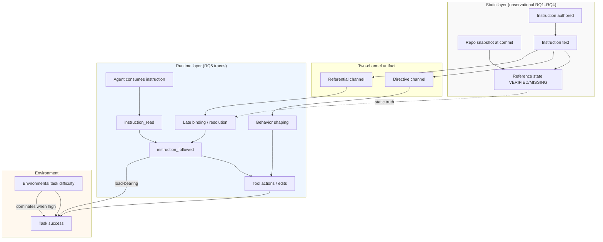

# Late-Binding Model of Machine-Consumed Instruction Files (v1)

**Status:** Conceptual synthesis — no new experiments  
**Version:** `LATE_BINDING_MODEL_v1`  
**Date:** 2026-07-03  
**Scope:** Integrates RQ1–RQ4 observational evidence, confirmatory audits, P4 validation, and RQ5 A/B/C agent runs (frozen outputs only)

---

## Core thesis

Machine-consumed instruction files (AGENTS.md, skills, `.cursor/rules`, copilot instructions, etc.) are **not** static descriptive documentation in the human sense. They are **late-binding artifacts** composed of two coupled channels:

1. **Directive channel** — normative text that shapes agent goals, constraints, and tool-use policy (*what to do*, *how to behave*).
2. **Referential channel** — pointers (paths, commands, configs) intended to be **resolved against the live repository at use time**, not at write time.

Truth or falsity is therefore split:

- **Static truth:** whether a claim matches the repository snapshot when the file was authored or last edited.
- **Runtime resolution:** whether the agent successfully binds each referential pointer to an existing, actionable target when the file is consumed.

Staleness, born-false claims, and agent failure are often misattributed to “documentation decay” when they are better explained as **misalignment between static text and runtime binding**, moderated by **environmental task difficulty** and **causal load-bearing** of specific references.

---

## Core constructs

| Construct | Definition |
|-----------|------------|
| **Directive channel** | Language that instructs agent behavior without requiring a resolvable repo pointer (policies, style rules, “run tests before finishing”). |
| **Referential channel** | Claims that delegate work to concrete repo artifacts (paths, scripts, configs) whose existence must be verified at use time. |
| **Late binding** | Resolution of referential pointers at agent consumption time against the current workspace, not at instruction authoring time. |
| **Static truth** | Verifiable alignment between instruction text and a pinned commit snapshot (mechanical VERIFIED/MISSING in longitudinal panel). |
| **Runtime resolution** | Agent attempt to locate, open, edit, or execute referential targets during a task (trace: read → follow → act). |
| **Read–repair** | Agent reads a stale or false reference, detects failure, and substitutes or edits without external help (trace: `repaired_reference`, manual correction). |
| **Causal load-bearing reference** | A referential pointer on the task-critical path such that following it materially affects outcome (vs decorative mention). |
| **Environmental task difficulty** | Repo-specific friction (build, test suite, dependency graph) that dominates success independent of instruction truth. |

---

## 1. Conceptual model

### 1.1 Two-channel instruction artifact

```
┌─────────────────────────────────────────────────────────────┐
│         Machine-consumed instruction file                    │
├──────────────────────────┬──────────────────────────────────┤
│   DIRECTIVE CHANNEL      │   REFERENTIAL CHANNEL             │
│   (behavioral policy)    │   (pointers → repo)               │
│                          │                                   │
│   "run pytest"           │   "see src/core/setup.py"         │
│   "small bounded change" │   ".codex/config.toml"            │
│   "use repo snapshot"    │   "npm run build:cli"             │
└────────────┬─────────────┴──────────────┬────────────────────┘
             │                            │
             v                            v
      Agent planning /            Late binding at
      tool policy                 consumption time
             │                            │
             └──────────┬─────────────────┘
                        v
              Task execution + tests
                        │
                        v
                   Outcome (success)
```

**Key implication:** A file can be **statically false** on the referential channel yet **directive-rich**, still producing high read/follow rates and large diffs (agent activity) without improving success.

### 1.2 Late-binding lifecycle

1. **Authoring** — human or agent writes instruction text against an implicit snapshot.
2. **Static verification** — longitudinal panel records VERIFIED/MISSING at each commit.
3. **Consumption** — coding agent reads file; directive channel activates behavior; referential channel triggers binding attempts.
4. **Resolution** — pointers succeed, fail silently, or trigger read–repair.
5. **Outcome** — dominated by environmental task difficulty unless reference is **causal load-bearing**.

Born-stale references skip step 2’s “ever VERIFIED” path: they enter the corpus already MISSING — **false at creation** from the agent’s binding perspective.

---

## 2. Causal DAG (simplified)



**Reading the DAG:**

- **Static truth** (RQ1–RQ4) affects whether binding *can* succeed but does not directly cause agent success.
- **Directive channel** can activate even when referential channel is false or absent (RQ5 C vs A/B file-modification gap).
- **Environmental task difficulty** is a confound that suppresses detectable differences between truthful and false instructions when baseline failure is ~88%.

---

## 3. Mapping empirical results to the model

| Empirical result | Source | Model interpretation |
|------------------|--------|----------------------|
| **0 genuine post-verification decay** (0/121 failures) | RQ2 failure audit | Apparent VERIFIED→MISSING transitions are overwhelmingly extractor/rename artifacts, not ongoing referential rot after verification. Supports **static panel ≠ runtime binding failure mode**. |
| **Heterogeneous born-stale taxonomy** (7 categories, 17,747 cohort) | Born-stale autopsy | References enter MISSING through multiple static mechanisms (template, anchor, normative, genuine false). **Referential channel is heterogeneous**, not a single decay process. |
| **1,200 confirmed false at creation** (85.4%) | GFC confirmatory audit | Large class of references never valid at first observation — **born-false static claims**, not time-decay. |
| **85.4% cited paths ≤ uncited churn** | Cited–uncited audit | Instruction files **preferentially cite stable paths** (selection). Explains why false pointers may be peripheral: repos already channel references toward low-churn artifacts. |
| **Agent maintenance attribution F1=0.962** | P4 validation | Agent edits to instruction files are **measurably attributable**; maintenance signal is real, separate from runtime task success. |
| **A ≈ B success (12.7% vs 12.7% on 63 triplets)** | RQ5 ABC analysis | **Static truth of referential channel does not differentiate success** when directive channel and environment dominate. |
| **C success 7.9% vs A 12.7% (Δ=+4.8 pp, CI includes 0)** | RQ5 ABC analysis | Instruction **presence** may help marginally; not conclusive. Directive channel adds context but does not overcome task difficulty. |
| **100% instruction_read** | RQ5 uptake (128 runs) | Agents **always open** the instruction file when present — directive + referential surface is attended. |
| **77.8% instruction_followed (B)** | RQ5 uptake | Majority **attempt late binding** on anchor reference even when statically false — referential channel is executive, not decorative. |
| **A/B ~100 files modified vs C ~2** | RQ5 ABC (63 triplets) | Directive + referential content **expands agent edit scope** (~50× files touched). Presence of instruction file reshapes behavior even without success gain. |
| **No A−B success difference (McNemar p=1.0)** | RQ5 ABC | Swapping truthful vs false **referential static truth** does not change outcomes when binding and environment subsume the effect. |
| **Tests_failed dominates failures** | RQ5 uptake | Outcome gated by **environmental task difficulty** (test command), not instruction reading per se. |

---

## 4. Alternative explanations

| Alternative | Claim | Current data |
|-------------|-------|--------------|
| **Decorative instructions** | Agents ignore instruction files; null effects = non-use | **Weakened.** 100% read, ~77% follow on B. Instructions enter causal path. |
| **Agent robustness to false refs** | Agents detect and ignore false pointers | **Partially weakened.** False claim used in 77.8% of B runs; success among users (16.3%) ≈ success among truthful followers (14.9%). Suggests **non-robust following**, not robust rejection. |
| **Measurement artifact only** | No real staleness or false claims | **Weakened for born-false** (1,200 confirmed). **Supported for post-verification decay** (0 genuine). Model splits these paths. |
| **Instruction files are static docs** | Same semantics as README | **Weakened.** Late-binding + agent traces show consumption-time resolution distinct from static panel. |
| **Selection on stable paths** | References appear stable because repos cite easy paths | **Supported** (85.4% paired stability). Explains peripheral false claims with low causal load. |
| **Task difficulty dominates** | Any instruction manipulation drowned by hard tests | **Supported.** ~88% failure all arms; compile 100%. Environmental gate masks instruction effects. |
| **Claude Code specific behavior** | Results do not generalize | **Open.** Single agent family; API/CLI coupling not cross-validated. |

---

## 5. Threats to validity

1. **Single agent platform** — RQ5 uses Claude Code CLI only; directive/referential uptake may differ on IDE-integrated or headless agents.
2. **Incomplete ABC coverage** — A/B on 22/35 cases; C complete on 35. Full factorial not yet aligned.
3. **Low success rate / power** — ~12% success yields wide CIs; cannot exclude small effects.
4. **Mechanical verification limits** — VERIFIED/MISSING heuristics misclassify rename, anchor, and extractor edge cases (73.6% extractor artifact in RQ2 audit).
5. **Confound: instruction presence enlarges edit surface** — More files modified under A/B may increase test failure independent of reference truth.
6. **Born-stale ≠ post-decay conflation** — Observational prevalence rates are not interchangeable (explicitly separated in RQ3/RQ4).
7. **Trace parsing fidelity** — `instruction_followed` inferred from tool events; may over- or under-count binding.
8. **No human baseline condition in RQ5** — C removes instruction file but does not replace with README/CONTRIBUTING descriptive doc.

---

## 6. Implications for future research

1. **Pre-register causal load-bearing strata** before agent experiments — separate peripheral vs task-critical references (RQ5 redesign plan: load-bearing flags).
2. **Always include a no-instruction arm (C)** — null A/B is uninterpretable without presence baseline.
3. **Report uptake funnel** (read → follow → act → success) separately from outcome — distinguishes decorative vs executive referential channel.
4. **Do not merge born-stale and post-verification rates** in reviewer-facing claims.
5. **Pair static panel with runtime binding traces** — longitudinal truth ≠ consumption-time resolution.
6. **Power tasks for binding** — select cases where referential channel is load-bearing and environment difficulty is calibrated (not ceiling-failure).
7. **Cross-agent replication** — minimum two agent classes (IDE vs CLI) on identical pinned workspaces.

---

## 7. Implications for tool builders

1. **Split UI/constraints for directive vs referential content** — validators should lint pointers separately from policy text.
2. **Late-binding lint at consumption** — resolve referential channel against workspace **when agent starts**, not only at commit time.
3. **Load-bearing markers** — annotate which references are task-critical vs contextual; agents may deprioritize peripheral pointers.
4. **Read–repair telemetry** — surface when agents substitute paths; useful for truth-debt accounting without blaming “model robustness.”
5. **Do not assume file presence implies correctness** — 100% read rate with false static claims shows files are consumed even when wrong.
6. **Scope control** — directive channel without referential grounding inflates edit blast radius (~100 files); consider bounded-workspace defaults.

---

## 8. Claims NOT supported by current evidence

| Unsupported claim | Why |
|-------------------|-----|
| **Post-verification reference decay is common** | 0/121 genuine decay after audit adjustment. |
| **False instructions reliably harm agent success** | A ≈ B; no paired difference; CI includes zero. |
| **True instructions reliably help agent success** | A vs C Δ=+4.8 pp, not significant; high baseline failure. |
| **Instruction files are ignored** | 100% read when present. |
| **Agents consistently reject false pointers** | 77.8% follow/use false anchor on B. |
| **Truth decay implies operational cost (Truth Debt promoted)** | No measurable success cost attributable to referential falsity in RQ5. |
| **Cited paths are less stable than uncited** | Mean churn CI crosses zero; cited paths are if anything **more** stable in 85.4% of pairs. |
| **Generalization across all coding agents** | Single-agent RQ5 pilot. |
| **Human docs behave like machine instruction files** | P5 descriptive only; not causal in RQ5 design. |

---

## 9. Synthesis statement

The laboratory evidence supports a **late-binding model**: machine-consumed instruction files couple **behavioral directives** with **deferrable referential pointers** resolved at agent runtime. Observational work (RQ1–RQ4) maps the **static truth** of those pointers across repository history — showing abundant **born-false** claims and negligible **genuine post-verification decay**. Agent experiments (RQ5) show **near-universal reading**, **majority following** of even false anchors, and **large behavioral amplification** (files touched) when any instruction is present — yet **no clear success difference** between truthful and false referential content under high environmental task difficulty.

The null causal effect on success does **not** imply instructions are ignored; it implies that **static referential truth is filtered through late binding and task environment**, and that many false claims are **not causal load-bearing** or are **followed without differential outcome**. The research program should separate **integrity of the static artifact** (Truth Decay observational claim) from **operational cost of consumption** (Truth Debt conditional claim) — and measure both channels explicitly in future causal designs.

---

## Version history

| Version | Date | Change |
|---------|------|--------|
| v1 | 2026-07-03 | Initial conceptual synthesis from frozen RQ1–RQ5 outputs |
