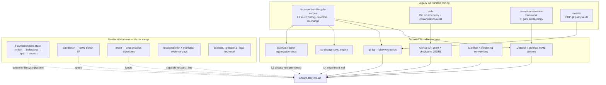

# Architecture audit — `~/papers/` vs `artifact-lifecycle-lab`

**Date:** 2026-07-02  
**Scope:** Read-only inventory of all repositories and notable workspaces under `/home/cesar/papers/`.  
**Goal:** Verify that `artifact-lifecycle-lab` does not unnecessarily duplicate prior work; identify reusable assets, collisions, and redesign risks before scaling.

**This is not a migration plan.** No code was changed during this audit.

---

## Executive summary

`artifact-lifecycle-lab` is a **justified greenfield rewrite** of one legacy spine (`ai-convention-lifecycle-corpus`) with deliberate architectural corrections (ephemeral clones, versioned Parquet datasets, SQLite job queue, content-addressed blobs). It does **not** duplicate the large FSM/LLM benchmark ecosystem, EarnBench, INVERT, or municipal governance corpora.

The highest collision risk is **internal**: three related GitHub-mining efforts (`ai-convention-lifecycle-corpus`, `vsdlc`, `prompt-provenance-framework`) plus the new lab share domain but split across discovery, extraction, and experiment protocols. Without explicit boundaries, L0 discovery and detector families will be reimplemented a fourth time.

**Verdict:** Keep the lab’s spine; **redesign before scaling** the discovery/registry boundary (unify L0 with `vsdlc`), formalize a shared manifest contract, and plan L4 co-change as a port-from-legacy experiment leaf—not a second implementation in core.

---

## Repositories inspected

### Git repositories (28 paths)

| Path | Status | Purpose (one line) |
|------|--------|-------------------|
| `/home/cesar/papers` | meta-repo | Shared bibliography (`bibliography.bib`), merge scripts, cross-paper assets |
| `artifact-lifecycle-lab/artifact-lifecycle-lab` | **active platform** | Git artifact lifecycle mining (L0–L5 spine, pilot slice) |
| `legacy/ai-artifact-cochange/ai-convention-lifecycle-corpus` | legacy/frozen | MSR corpus: AI instruction artifact adoption–maintenance gap |
| `legacy/behavioral-fsm-benchmark/behavioral-fsm-benchmark` | legacy | FSM behavioral benchmark framework (extends FSM-Bench-20) |
| `legacy/behavioral-fsm-benchmark/paper` | paper only | Manuscript workspace |
| `legacy/fsmrepairbench/fsmrepairbench` | legacy | FSM repair benchmark toolkit (Typer CLI, Ollama) |
| `legacy/oracle-observational-coverage/oracle-observational-coverage` | abandoned | Empty git repo (placeholder) |
| `legacy/maestro` | legacy/paper | ERP git policy audit paper (OpenERP 6.1) |
| `vsdlc/vsdlc` | active/replication | GitHub discovery-frame contamination audit (Phases 1–2) |
| `vsdlc` (parent) | wrapper | Paper + class files around vsdlc package |
| `fsm-behavioural-predictors/fsm-behavioural-predictors` | frozen artifact | RAP-AQ statistical audit on frozen FSM campaign exports |
| `fsm-oracle-repair-loops/fsm-oracle-repair-loops` | frozen artifact | Iterative oracle-guided FSM repair (EMSE) |
| `fsm-oracle-repair-loops/paper` | paper only | Manuscript |
| `fsmreasonbench/fsmreasonbench` | frozen artifact | FSM formal reasoning benchmark (TOSEM) |
| `fsm-repairability-study/fsm-repairability-study` | frozen artifact | FSM repairability protocol + pilots (IST) |
| `llm-fsm-local-benchmark/llm-fsm-local-benchmark` | legacy/root | FSM-Bench-20 (precursor to behavioral-fsm-benchmark) |
| `llm-fsm-local-benchmark/paper` | paper only | Manuscript |
| `earnbench/earnbench` | active artifact | EarnBench EF measurement on SWE-bench patches |
| `dualexis/dualexis` | frozen artifact | TSGG trusted safety governance graph simulation |
| `fightsafe-ai/fightsafe-ai` | frozen artifact | Combat-sports video safety / TAPKO traceability |
| `fightsafe-ai/legacy/fightsafe-ai` | legacy copy | Older fightsafe tree |
| `invert/invert` | active research | INVERT Core v2 + LPR extension (code LLM process signatures) |
| `invert/paper` | paper only | Manuscript |
| `localgovbench/localgovbench` | frozen artifact | Local government LLM governance framework |
| `localgovbench/paper` | paper only | Manuscript |
| `municipal-ai-evidence-gaps/municipal-ai-evidence-gaps` | frozen artifact | Municipal AI governance document corpus (D1–D5 coding) |
| `municipal-ai-evidence-gaps/paper` | paper only | Manuscript |
| `municipal-ai-evidence-gaps/paper_backup_pre_v2_rewrite_20260616` | archive | Pre-rewrite paper snapshot |
| `legal-technical` | paper only | GDPR / EU AI Act legal-technical manuscript |

### Non-git workspaces (notable)

| Path | Purpose |
|------|---------|
| `prompt-provenance-framework/` | VDG repository archaeology pilot (CI gate scope rules); flat scripts, no `.git` |
| `array2026/` | IST paper workspace for FSM repair evaluation protocol |
| `SoSyM2026/` | Planning notes only (future EMSE iterative repair paper) |
| `invert-kernel/`, `invert-lpr/` | Empty placeholders (LPR code lives in `invert/invert`) |
| `promts/`, `scripts/`, `style_rules/`, `reports/`, `tmp/` | Author prompts, bib tools, scratch — not research platforms |
| `sota_pdfs/` | PDF collection |

---

## Dependency graph

---

## Reusable assets by component class

### Git mining / commit history extraction

| Source | Assets | Recommendation |
|--------|--------|----------------|
| `ai-convention-lifecycle-corpus` | `scripts/lifecycle/extract_history.py`, `git_utils.py`, `discover_v2.py` | **REFERENCE** — already mapped in `artifact_lab/docs/legacy_map.md`; ideas reimplemented, do not copy structure |
| `maestro` | `paper/scripts/git_policy_change_audit.py` | **IGNORE** — single ERP monorepo, different unit of analysis |
| `prompt-provenance-framework` | `vdg_archaeology_pilot.py` | **REFERENCE** — GitHub search + workflow YAML mining; future experiment leaf |
| `vsdlc` | Phases 1–2 only; **no clone/extract** in release | **REFERENCE** for L0, not L1 |

### GitHub API clients

| Source | Assets | Recommendation |
|--------|--------|----------------|
| `vsdlc` | `src/vsdlc_mining/github_client.py`, checkpoint JSONL, `seed_search.py`, `repo_filter.py` | **GENERALIZE** into L0 discovery module when scaling registry beyond static CSV |
| `ai-convention-lifecycle-corpus` | `scripts/independent_cohort/sample_cohort_300.py`, `gh api` in `git_utils.fetch_stars` | **REFERENCE** — cohort sampling ideas; avoid `gh` as hard dependency in core |
| `prompt-provenance-framework` | Search API usage in pilot scripts | **REFERENCE** for stratified repo search |

### DuckDB utilities

| Source | Assets | Recommendation |
|--------|--------|----------------|
| Entire `~/papers/` tree | **No production DuckDB code found** except README example in `artifact-lifecycle-lab` | **REWRITE** in lab when needed — no duplication risk; add thin query helpers when L2+ analytics grow |

### Parquet helpers

| Source | Assets | Recommendation |
|--------|--------|----------------|
| `ai-convention-lifecycle-corpus` | pandas `to_parquet` in lifecycle scripts | **IGNORE** — superseded by `artifact_lab/store/parquet.py` |
| `invert` | LPR corpus loaders (HF/Parquet benchmarks) | **IGNORE** — different domain (code benchmarks, not git events) |
| `earnbench` | `paper/vendor/swe_verified_test.parquet` | **IGNORE** |
| `fsm-behavioural-predictors` | `scripts/strengthen_io.py` | **IGNORE** |

### SQLite queues / pipeline state

| Source | Assets | Recommendation |
|--------|--------|----------------|
| `artifact-lifecycle-lab` | `artifact_lab/store/job_queue.py` (WAL) | **KEEP** — only intentional SQLite queue in the research stack |
| Others | None for extraction pipelines | No collision |

### Protocol YAMLs / detector logic

| Source | Assets | Recommendation |
|--------|--------|----------------|
| `ai-convention-lifecycle-corpus` | `protocol/lifecycle_v1.yaml`, `gh_actions_v1.yaml`, `dependabot_v1.yaml`; `detection.py` | **REFERENCE** — `ai_conventions_v1` already ported; other families **COPY IDEAS** into new YAML commits, not files |
| `vsdlc` | Markdown protocols + path predicates in Python | **REFERENCE** for L0 frame definitions; convert to YAML families when merging discovery |
| `prompt-provenance-framework` | SC1–SC6 binary rules in Markdown | **REFERENCE** — candidate `ci_gate_scope_v1` experiment family |
| `localgovbench` | `localgovbench_criteria_v0.yaml` | **IGNORE** for git platform — different evidence type (public PDFs/HTML) |
| FSM repos | JSON schemas, oracle specs | **IGNORE** |

### Blob storage

| Source | Assets | Recommendation |
|--------|--------|----------------|
| `artifact-lifecycle-lab` | `artifact_lab/store/blobs.py` (SHA-256, `.txt`) | **KEEP** |
| Legacy | No content-addressed blob store (relied on permanent clones) | N/A — lab innovation, not duplicate |

### Ownership extraction

| Source | Assets | Recommendation |
|--------|--------|----------------|
| None found | No dedicated ownership layer | **REWRITE** at L3 when needed; no prior implementation to duplicate |

### Co-change analysis

| Source | Assets | Recommendation |
|--------|--------|----------------|
| `ai-convention-lifecycle-corpus` | `scripts/cochange/sync_engine.py`, `extract_changed_files.py`, scope modes | **REUSE SMALL PARTS** as `artifact_lab/experiments/cochange_*` leaf — **do not** port into `artifact_lab/derive` core |
| `prompt-provenance-framework` | CI input/output scope rules | Related conceptually; different construct (gate scope vs file co-touch) |

### Survival / panel analysis

| Source | Assets | Recommendation |
|--------|--------|----------------|
| `ai-convention-lifecycle-corpus` | `ACTIVE`/`DORMANT` states, `decision_impact.py`, Kaplan–Meier in analysis JSON | **REFERENCE** — L2 reimplemented with different state ontology; survival stats belong in **experiments**, not core panel |
| `artifact-lifecycle-lab` | `artifact_lab/derive/panel.py` (`absent/young/active/stale/deleted`) | **KEEP** — deliberate schema break from legacy |

### GitHub Archive processing

| Source | Assets | Recommendation |
|--------|--------|----------------|
| None in `~/papers/` | No GH Archive ingestion pipelines | **IGNORE** unless future L0 needs event-time discovery at scale |

### LLM infrastructure / prompt caching

| Source | Assets | Recommendation |
|--------|--------|----------------|
| FSM stack, `invert`, `earnbench` | Ollama clients, provider runners, prompt dirs | **IGNORE** for lifecycle platform until L5; no duplicate in lab today |
| `dualexis` | MockLLM only | **IGNORE** |

### Benchmarking code

| Source | Assets | Recommendation |
|--------|--------|----------------|
| FSM ecosystem (6+ repos) | Oracle scoring, gold FSMs, Typer CLIs | **ARCHIVE FOREVER** as separate line; zero merge into artifact-lifecycle-lab |
| `earnbench` | SWE-bench harness | **ARCHIVE FOREVER** (related topic, different estimand) |

### Dataset versioning / manifests

| Source | Assets | Recommendation |
|--------|--------|----------------|
| `artifact-lifecycle-lab` | `artifact_lab/store/manifest.py`, `contracts/datasets.py` (`v1/` paths) | **KEEP** — canonical going forward |
| `ai-convention-lifecycle-corpus` | `metadata/`, Zenodo, `extract_meta.json` | **REFERENCE** — field ideas only |
| `earnbench`, `invert`, FSM repos | `frozen_manifest.json`, checksums, `ARTIFACT_VERSION` | **REFERENCE** for manifest fields (`code_git_sha` already adopted) |
| `municipal-ai-evidence-gaps` | `corpus_manifest_v0_2.csv` | **REFERENCE** for document corpora, not git events |

### Snakemake / CI / CLI

| Source | Assets | Recommendation |
|--------|--------|----------------|
| Snakemake | **Not used** anywhere under `~/papers/` (only mentioned in vsdlc legacy audit doc) | Lab `artifact_lab/dag/` stub is fine; no duplicate workflow engine |
| CI | `earnbench`, `fightsafe-ai`, `behavioral-fsm-benchmark`, `fsmrepairbench`, `llm-fsm-local-benchmark` | **IGNORE** — adopt CI for lab when pilot stabilizes; no reuse needed |
| CLI | Legacy Makefile; FSM Typer CLIs; lab `python -m artifact_lab.ingest/derive` | **KEEP** lab pattern — avoid introducing a second CLI framework (Typer) unless ergonomics demand it |

---

## Architectural collisions

### 1. Duplicate detector implementations (high)

| Implementation | Location | Notes |
|----------------|----------|-------|
| `detection.py` + `lifecycle_v1.yaml` | legacy corpus | Regex + exclusions; `ACTIVE`/`DORMANT` coupling |
| `ai_conventions_v1.yaml` + `detector.py` | artifact-lifecycle-lab | Ported patterns; extended (`.cursorrules`, `.github/instructions`) |
| Path predicates / heuristics | `vsdlc_mining` | Discovery-frame predicates, not file-event detectors |
| SC rules | `prompt-provenance-framework` | CI workflow construct, overlapping repo search |

**Risk:** Four parallel rule systems for “AI-related paths in repos” without a shared protocol schema.

### 2. Incompatible repo identifiers (high)

| Scheme | Example | Where |
|--------|---------|-------|
| `owner/repo` | `rails/rails` | legacy `discovered_v2.csv` |
| `owner_repo` slug | `astral-sh_ruff` | early pilot registry (removed) |
| SHA-256 prefix (16 hex) | `a1b2c3...` | artifact-lifecycle-lab `contracts/repo_id.py` |

**Risk:** Cannot join legacy frozen Parquet to new L1 without an explicit mapping table. Lab choice is **correct for greenfield** but blocks silent reuse of legacy cohort keys.

### 3. Incompatible L1 / panel schemas (high)

| Layer | Legacy | artifact-lifecycle-lab |
|-------|--------|----------------------|
| L1 | `touch_history.parquet` (`artifact_path`, `touch_index`, `committed_at`) | `file_event_log` (`path`, `change_type`, `blob_sha`, `extraction_wave`) |
| L2 | `ACTIVE` / `DORMANT` at T=180 | `absent` / `young` / `active` / `stale` / `deleted` |
| Storage | Permanent `data/repos/` | Ephemeral `scratch/` + `data/blobs/` |

**Risk:** Papers or scripts assuming legacy column names will not run on new datasets without a documented transform layer.

### 4. Conflicting dataset layouts (medium)

| Layout | Where |
|--------|-------|
| `data/lifecycle/*.parquet` flat | legacy |
| `data/l1/file_event_log/v1/events.parquet` | lab |
| `data/raw/*.jsonl` + checkpoints | vsdlc |
| JSON/CSV frozen exports | FSM repos |

**Risk:** Low if lab never claims compatibility with legacy paths (currently true).

### 5. Protocol version proliferation (medium)

- Legacy: `lifecycle_v1`, `adoption_maintenance_v2`, independent cohort variants  
- Lab: `ai_conventions_v1` family version `1.0.0`, dataset `v1`  
- vsdlc: Markdown protocols with revision history  
- prompt-provenance: `protocol_v1.0` → `v1.1`  

**Risk:** Manifest `protocol_version` vs `dataset_version` vs family `version` must stay semantically distinct (lab is mostly OK).

### 6. Duplicate Git wrappers (low — acceptable)

- `artifact_lab/ingest/git_utils.py` reimplements legacy `git_utils.py` with bare-clone policy.  
- **Justified** by different clone contract; not worth extracting to a shared library yet.

### 7. Manifest format drift (low)

- Lab: YAML with `schema_hash`, `code_git_sha`, `dataset_version`  
- Legacy: `extract_meta.json`  
- FSM: `release_manifest.json`, checksum files  

**Risk:** Cross-project tooling won’t parse all manifests; acceptable if lab manifest is the single source for this platform.

### 8. Naming: `platform` package vs stdlib (low, contained)

- Lab shadows Python `platform` module; mitigated by `__init__.py` shim.  
- No other repo uses this name.

### 9. Parallel research lines with similar vocabulary (medium)

- “Artifact”, “protocol”, “panel”, “gap”, “maintenance” appear in legacy lifecycle, vsdlc contamination, municipal evidence gaps, EarnBench.  
- **Risk:** Author confusion, not code duplication.

---

## Per-project migration recommendation

| Project | Verdict | Justification |
|---------|---------|---------------|
| **ai-convention-lifecycle-corpus** | **KEEP AS LEGACY** | Frozen MSR replication; touch history and 209-repo cohort are paper-bound; new work belongs in lab |
| **vsdlc** | **REUSE SMALL PARTS** | Best L0 discovery implementation; merge `github_client` + checkpoint pattern into lab registry expansion, not a second repo |
| **prompt-provenance-framework** | **REUSE SMALL PARTS** | CI gate rules → future protocol family / experiment leaf |
| **maestro** | **ARCHIVE FOREVER** | ERP case study; no OSS lifecycle overlap |
| **behavioral-fsm-benchmark** | **ARCHIVE FOREVER** | FSM domain; frozen replication role |
| **llm-fsm-local-benchmark** | **ARCHIVE FOREVER** | Superseded by behavioral-fsm-benchmark for citations |
| **fsmrepairbench** | **ARCHIVE FOREVER** | Repair toolkit; Typer CLI ecosystem |
| **fsm-repairability-study** | **ARCHIVE FOREVER** | Frozen IST artifact |
| **fsm-oracle-repair-loops** | **ARCHIVE FOREVER** | Frozen EMSE artifact |
| **fsmreasonbench** | **ARCHIVE FOREVER** | Frozen TOSEM artifact |
| **fsm-behavioural-predictors** | **ARCHIVE FOREVER** | Secondary analysis on frozen exports |
| **oracle-observational-coverage** | **IGNORE** | Empty repository |
| **earnbench** | **ARCHIVE FOREVER** | SWE-bench EF instrument; thematic neighbor only |
| **invert** (+ empty invert-kernel/lpr) | **ARCHIVE FOREVER** | Code signature research; LPR stays in invert tree |
| **dualexis** | **ARCHIVE FOREVER** | Safety governance simulation |
| **fightsafe-ai** | **ARCHIVE FOREVER** | Video safety domain |
| **localgovbench** | **ARCHIVE FOREVER** | Public-sector governance docs; optional future **separate** corpus feed to L0, not merge |
| **municipal-ai-evidence-gaps** | **ARCHIVE FOREVER** | Document coding study; complements localgovbench, not git mining |
| **legal-technical** | **IGNORE** | Manuscript only |
| **array2026** | **IGNORE** | Paper wrapper for fsm-repairability-study |
| **SoSyM2026** | **IGNORE** | Planning folder |
| **papers/` (root)** | **REFERENCE** | Bibliography infrastructure only |
| **artifact-lifecycle-lab** | **KEEP — active platform** | Canonical git lifecycle spine going forward |

**MERGE** verdict: **None today.** Partial merge of vsdlc L0 into lab is a **future integration**, not a repo merge.

---

## Risks if the platform grows without redesign

1. **Fourth discovery implementation** — static CSV + legacy seeds + vsdlc search + prompt-provenance queries diverge.  
2. **Legacy cohort lock-in** — papers referencing `owner/repo` ids cannot be replayed on new L1 without migration tooling.  
3. **Co-change reimplementation** — `sync_engine.py` is substantial; re-coding in core would duplicate ~30 scripts worth of edge cases.  
4. **L5 LLM sprawl** — FSM repos contain many Ollama clients; importing any into core would drag wrong abstractions.  
5. **`platform` package name** — technical debt grows with every new dependency that imports stdlib `platform`.  
6. **DuckDB/query layer missing** — analytics will sprawl into ad-hoc scripts (legacy pattern) unless planned early.  
7. **vsdlc Phase 3+ gap** — lab does extraction; vsdlc stops at filter; neither owns “release-unit trace” yet — risk of overlapping future scopes.

---

## Proposed actions (documentation and design only — no code yet)

| Priority | Action |
|----------|--------|
| P0 | Extend `artifact_lab/docs/legacy_map.md` with **vsdlc** and **prompt-provenance** cross-links (this audit supersedes for breadth). |
| P0 | Document **repo_id mapping** from legacy `owner/repo` → normalized URL → new hash for any legacy cohort reuse. |
| P1 | Design **L0 module** that can ingest vsdlc JSONL exports OR static CSV under one registry contract. |
| P1 | Register **protocol families** (`gh_actions_v1`, `dependabot_v1`, `ci_gate_scope_v1`) as YAML commits without implementing extract yet. |
| P2 | Plan **L4 co-change** as `artifact_lab/experiments/cochange/` port with read-only dependency on L1 Parquet. |
| P2 | Add **DuckDB views** or thin SQL files as derive leaves, not core ingest. |
| P3 | Consider renaming import package from `platform` → `artifact_platform` before external consumers appear (CLI can remain `python -m artifact_lab.ingest` via shim module). |

---

## Answer: would we keep `artifact-lifecycle-lab` exactly as-is?

**No — keep the spine, redesign three boundaries before scaling.**

### What is already correct (do not throw away)

- Ephemeral bare clones + blob store + Parquet permanence  
- Layered L0–L5 layout with experiments as leaves  
- SQLite WAL job queue + resume/`--force`  
- Versioned dataset directories (`v1/`) + manifests  
- Deterministic `repo_id` from normalized URL (better than legacy `owner/repo`)  
- Deliberate break from legacy `ACTIVE`/`DORMANT` panel semantics  

### What should change before growth

1. **L0 discovery unification**  
   - **Problem:** Pilot registry is static CSV; vsdlc already implements GitHub search, checkpoints, and contamination-aware filtering.  
   - **Change:** Treat `data/registry/*.csv` as one **input format** to a future `artifact_lab/ingest discover` that can also consume vsdlc JSONL. Do not reimplement GitHub search a fourth time in extract.

2. **Explicit legacy ID bridge**  
   - **Problem:** Legacy frozen data uses `owner/repo` keys.  
   - **Change:** Add a documented mapping contract (not necessarily code yet) in `contracts/` for cohort joins across papers.

3. **Protocol registry discipline**  
   - **Problem:** Detectors live in three silos (legacy YAML, lab YAML, vsdlc Python predicates).  
   - **Change:** All path predicates for mining must be **YAML families** in `artifact_lab/protocol/families/`; vsdlc predicates become exportable YAML, not parallel Python rules.

4. **Co-change as experiment leaf only**  
   - **Problem:** Legacy `scripts/cochange/` is the largest unreplicated asset for L4.  
   - **Change:** Port minimally into `artifact_lab/experiments/` with frozen inputs; **forbid** writing coupling tables into `data/l1/` or `data/derived/`.

5. **Package naming**  
   - **Problem:** `platform` shadows stdlib; shim works but is fragile.  
   - **Change:** Before publishing or adding heavy dependencies, rename internal package or isolate CLI entrypoints.

6. **Query layer**  
   - **Problem:** DuckDB is listed in stack but unused; legacy used pandas + ad-hoc scripts.  
   - **Change:** Add `artifact_lab/derive/query/` or documented `.sql` snapshots as versioned artifacts when pilot summary outgrows Python.

### What we would **not** redesign

- FSM benchmark repos (stay archived)  
- EarnBench / INVERT pipelines  
- Municipal document corpora (separate evidence type)  
- Permanent git clone layout (correctly rejected)  

---

## Conclusion

`artifact-lifecycle-lab` **does not unnecessarily duplicate** the majority of `~/papers/` (FSM, EarnBench, INVERT, governance document studies). It **does intentionally supersede** `ai-convention-lifecycle-corpus` for git lifecycle mining with a cleaner architecture.

The unnecessary duplication risk is **concentrated in the GitHub AI-artifact discovery lane** shared with **vsdlc** and **prompt-provenance-framework**. Addressing L0 integration and protocol centralization now prevents expensive rework at L3–L5 scale.

---

*Audit method: filesystem traversal of `find …/.git`, README/pyproject reads, targeted ripgrep for stack keywords (`parquet`, `sqlite`, `duckdb`, `AGENTS.md`, `cochange`, `manifest`), and spot-checks of legacy CSV schemas and vsdlc package layout. No repositories were modified.*
